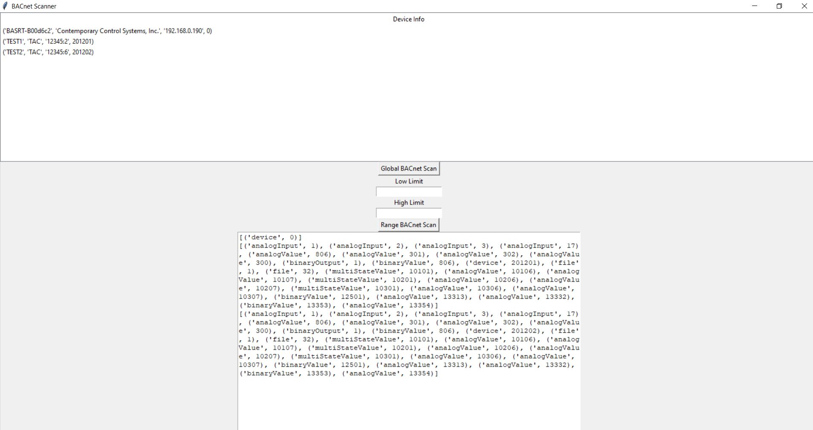

# BAC0-GUI

This is a Python based GUI meant to run on Windows for a BACnet scan tool inspired by [YABE](https://sourceforge.net/projects/yetanotherbacnetexplorer/). 
BACnet under the hood runs BAC0, see the official [BAC0 documention](https://bac0.readthedocs.io/en/latest/) for more information.

## Setup
I am working with a version of Python 3.10

```bash
py -m pip install tkinter BAC0
```

## Run App
```bash
py app.py
```

## Example



## Optional - .exe file creation (work in progress)
Install pyinstaller 

```bash
py -m pip install pyinstaller 
```
Make .exe file with pyinstaller 
```
pyinstaller --onefile app.py
```

## Author

[linkedin](https://www.linkedin.com/in/ben-bartling-510a0961/)

## Licence

【MIT License】

Copyright 2024 Ben Bartling

Permission is hereby granted, free of charge, to any person obtaining a copy of this software and associated documentation files (the "Software"), to deal in the Software without restriction, including without limitation the rights to use, copy, modify, merge, publish, distribute, sublicense, and/or sell copies of the Software, and to permit persons to whom the Software is furnished to do so, subject to the following conditions: The above copyright notice and this permission notice shall be included in all copies or substantial portions of the Software. THE SOFTWARE IS PROVIDED "AS IS", WITHOUT WARRANTY OF ANY KIND, EXPRESS OR IMPLIED, INCLUDING BUT NOT LIMITED TO THE WARRANTIES OF MERCHANTABILITY, FITNESS FOR A PARTICULAR PURPOSE AND NONINFRINGEMENT. IN NO EVENT SHALL THE AUTHORS OR COPYRIGHT HOLDERS BE LIABLE FOR ANY CLAIM, DAMAGES OR OTHER LIABILITY, WHETHER IN AN ACTION OF CONTRACT, TORT OR OTHERWISE, ARISING FROM, OUT OF OR IN CONNECTION WITH THE SOFTWARE OR THE USE OR OTHER DEALINGS IN THE SOFTWARE.
